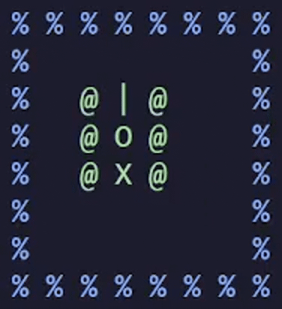

# CS100 Tank

[TOC]

## 前言

我们设计这次作业的初衷是希望大家能一边学习编程，一边感受设计、实现游戏的乐趣。同时，也能让大家有机会欣赏到一些 C 语言的“魔法”。如果这份框架能让您感叹到：“原来这么多行代码也可以组织得井井有条啊”，或是“太神奇了，原来 C 语言还能这么写啊”，那我们的努力就是值得的，也万分感谢您成为这份代码的读者。

那么，开始我们的游戏之旅吧！


## 作业简介

### 作业目标

我们这次作业将会在终端 (Terminal) 中复刻著名的[坦克大战 1990 (Tank 1990)](https://www.retrogames.cz/play_1412-NES.php)。这个 `gif` 展示了我们的最终目标：


在 `gif` 中，我们可以看到，游戏随机地生成了一个场景，玩家需要控制绿色的那辆坦克，通过射击炮弹，击败所有的红色敌方 AI 坦克。场景中还有一些坚实 (无法破坏) 的固体和不坚实 (可以破坏) 的墙体，分别用 `%` 和 `#` 这两种字符表示。

我们可以在 `Tank` 目录下看到 `Main.c` 这个源文件，试着通过 `gcc Tank/Main.c` 等指令来编译它，编译完毕之后，打开一个尺寸足够大的终端，运行可执行文件，我们可以看到一个“绿块”飞速地从最下面跑到了最上面：


随后什么事情都不会发生，您可以通过按 `ESC` 来退出。没错，那个“绿块”就是玩家需要控制的那辆坦克，当然，目前它既长得不像一辆坦克，也完全无法控制。我们的目标是，为它设计好看的造型，同时实现坦克大战这个游戏。我们来大致罗列一下具体需要完成的内容：

1. 通过“WASD”等按键移动坦克：

    

2. 坦克的移动会被各种东西阻挡：

    

    

    

3. 通过“K”等按键指挥坦克射击炮弹：

    

4. 炮弹无法破坏坚实的固体，但可以破坏不坚实的墙体：

    

5. 炮弹会破坏敌方坦克：

    

6. 设计 AI 控制敌方坦克的移动和射击，您只需要实现随机移动、随机射击的笨蛋 AI 即可：

    

7. 随机地生成场景：

    

8. 将上述所有内容整合成一个完整的游戏：

    


### 作业框架简介

通过这些 `gif`，您可能已经感受到了，一个完整的坦克大战游戏主要由两大部分组成：
+ 核心逻辑：用户通过键盘输入操纵坦克，场景中子弹、坦克的状态每时每刻都会自动地发生变化。
+ 画面呈现：为场景中的物体定义合适的字符和颜色，并将它们好看地显示出来。

正巧的是，`Tank` 目录下恰好有这么两个文件：`Game.h` (游戏) 和 `Renderer.h` (渲染器)，并且它们拥有这样的结构关系：
```bash
Main.c
├─ Game.h
   ├─ Renderer.h
```

`Renderer.h` 是专注于“画面呈现”的文件，而 `Game.h` 则包含了整个游戏的所有内容，也因此同时包含了“核心逻辑”和“画面呈现”，是个更大的存在。所以 `Game.h` 自然地会依赖 (包含) `Renderer.h`。总之，“核心逻辑”相关的代码会写在 `Game.h` 中，“画面呈现”相关的代码会写在 `Renderer.h` 中。

`Tank` 目录下还有一个相当重要的文件，`Scene.h`，它定义了场景中具体有哪些物体，例如坦克、炮弹等。将 `Scene.h` 加入我们的结构：
```bash
Main.c
├─ Game.h
   ├─ Renderer.h
      ├─ Scene.h
```

因为不论是“核心逻辑”还是“画面呈现”，都需要知道场景中具体有哪些东西，所以 `Game.h` 和 `Renderer.h` 自然都会依赖 (包含) `Scene.h`。

`Game.h`，`Renderer.h`，`Scene.h` 是我们坦克大战最核心的 3 个文件，也是您完成作业最需要关注的文件。更具体地说，本次作业只会要求您往这 3 个文件中添加代码。说得再详细一些，就是**往 `Game.h` 中添加“核心逻辑”相关的代码；往 `Renderer.h` 中添加“画面呈现”相关的代码；可能偶尔也需要往 `Scene.h` 的场景中加一点东西**。

在了解了作业框架的宏观结构之后，我们还需要更详细地了解 `Tank` 目录下各个文件的具体职能，以及这些文件之间的关系，这样我们才能知道具体得添加哪些代码才能完成作业。


## 作业框架详情

### 文件结构

这是我们第一次遇到这么多文件，有一大堆 `.h` (头文件) 和一个 `Main.c` (源文件) 呢。首先，我们得来看看这些头文件之间的关系是什么样的。我们知道，一个头文件会包含另一个头文件，最终会被 `Main.c` 包含，这样的包含关系正暗示了它们之间的“依赖关系”。举个例子，西餐厅的“意式肉酱面”可能会依赖于“意式肉酱”和“面”两个部分，那么 `SpaghettiBolognese.h` (意式肉酱面) 可能就会包含 `ItalianBologneseSauce.h` (意式肉酱) 和 `Noodle.h` (面)。

我们可以根据这种包含关系整理出 `Tank` 目录下这些文件之间的依赖关系：
```bash
Main.c
├─ Game.h
   ├─ Config.h
   │  ├─ Base.h
   │     ├─ Macros.h
   ├─ Renderer.h
      ├─ Scene.h
         ├─ Registry.h
         │  ├─ Base.h
         │     ├─ Macros.h
         ├─ Terminal.h
            ├─ Base.h
               ├─ Macros.h
```

这也太复杂了吧……但请别怕，我们将它用更好看的形式画出来，它其实长这样：


您可以看到，在右上角有两个常客：`Base.h` 和 `Macros.h`。打开 `Base.h` 和 `Macros.h`，通过阅读文件开头注释中的 `\brief` (简介) 部分，我们了解到 `Base.h` 包含了一系列最基础的小功能。所以 `Base.h` 也会理所当然地包含 `Macros.h`，因为那堆宏也算是小功能嘛。因此这两个头文件必然是我们的常客。

我们将图中的 `Base.h` 和 `Macros.h` 省略掉，结构一下子就变得清晰了起来：
```bash
Main.c
├─ Game.h
   ├─ Config.h
   ├─ Renderer.h
      ├─ Scene.h
         ├─ Registry.h
         ├─ Terminal.h
```

这里还有两个特殊的家伙：`Registry.h` 和 `Terminal.h`。

先来看看 `Registry.h`。如果您打开 `Registry.h`，会发现它面目狰狞，完全看不懂。但别害怕，它其实只是一个能让我们的游戏逻辑实现得更轻松的小工具而已，这样的工具通常被称为“基础设施”。我们会在教程的后续部分详细地介绍它，到时候您将发现，`Registry.h` 会让我们写作业变得超轻松。

再来看看 `Terminal.h`。通过阅读文件开头注释中的 `\brief` (简介) 部分，我们了解到它是负责配置终端 (Terminal)，让游戏能够在其中运行的工具，也就是说，它同样是“基础设施”的一部分。

既然它们都是“基础设施”，就意味着您在写作业的过程中不需要阅读里面的任何一行具体实现，只需要在相应的地方调用一下里面的函数就搞定了。因此，您丝毫不必对这两个文件感到害怕。

我们将图中的 `Registry.h` 和 `Terminal.h` 省略掉，结构变得更清晰了：
```bash
Main.c
├─ Game.h
   ├─ Config.h
   ├─ Renderer.h
      ├─ Scene.h
```

最后剩下的这几个文件是跟我们的游戏最直接相关的，我们会在教程的后续部分详细地介绍它们。这样的文件结构也暗示了我们可以通过 `gcc Tank/Main.c` 等指令来编译这个项目，正如我们在“作业简介”那边学到的那样。


### 黑魔法 `Registry.h`

> 人没有牺牲的话就什么都得不到，为了得到什么东西，就必须付出同等的代价，这就是炼金术的“等价交换”原则！

我们渴望有谁能帮我们管理所有的坦克、所有的炮弹；我们渴望更自动化的内存管理；我们渴望更简洁的代码；我们渴望在 C 语言中得到强如 Python 数组那般强大的容器。

在贪婪的驱使下，我们触碰了 C 语言编程的黑魔法：宏；我们在 C 语言中构筑出了通用容器；我们能够遍历容器中的所有元素；我们甚至做到了编译时的类型检查；最终，我们得到了 `Registry.h`。

**那么，代价是什么？**

**我们必须严格遵守 `Registry.h` 文件开头注释中的 `\example` (例子) 部分的标准使用方式。任何其他写法都有可能受到黑魔法的反噬。**

这一切是否值得？没有人能下定论。这就是炼金术的“等价交换”原则！

言归正传，通过阅读 `Registry.h` 文件开头注释中的 `\brief` 和 `\note` 部分，我们可以了解到，这个“基础设施”的职能类似于“助教”：
1. 开学的时候要把大家收集到“助教”负责的习题课班上。
2. “助教”负责管理一个习题课班的所有学生，比如上习题课要点名 (遍历所有学生)。
3. 结课之后，人生有梦各自精彩。

我们来看 `\example` 的第一个例子，如何使用 `Registry` 来管理一些最基本的变量：
```c
#include "Registry.h"

typedef struct {
  //! `TK_REG_AUTH` 这个宏负责为 `Foo` 这个 `struct` “授权”，
  //! 使得 `Foo` 能够和 registries 配合使用。
  //! 它需要被放在 `struct` 的定义里面，仿佛是个成员变量一样。
  TK_REG_AUTH;
  int bar;
} Foo;

//! `TK_REG_DEF` 这个宏实例化 (创建) 了一个名叫 `regFoo` 的 registry，
//! 它只能负责管理 `Foo` 类型的变量。
//! 注意到这里我们写了 `static`，所以 `regFoo` 是一个全局的 registry。
static TK_REG_DEF(Foo, regFoo);

int main(void) {
  //! 在真正使用 `regFoo` 之前，必须调用 `RegInit` 对其做初始化。
  //! 任何 registry 都需要被调用 `RegInit`.
  RegInit(regFoo);

  // 创建两个 `Foo` 类型的变量，并初始化它们的成员 `bar`。
  Foo foo0 = {.bar = 233};
  Foo foo1 = {.bar = 466};

  //! 调用 `RegAdd` 将 `foo0` 和 `foo1` 都“注册”到 `regFoo`。
  //! 所谓的“注册”并不会对变量做任何拷贝，而仅仅只将它们的指针进行保管，
  //! 因此这里需要对它们取地址。
  //!
  //! 如何您不小心使用 `RegAdd` 去添加一个类型不是 `Foo *` 的指针，
  //! 编译器会察觉到这一点，然后告诉您不能这么做，这就是黑魔法的威力。
  RegAdd(regFoo, &foo0);
  RegAdd(regFoo, &foo1);
  //! 我们可以打印出，目前有多少个变量已经被注册到某个 registry 中。
  printf("Number of registered instances: %d\n", (int)RegSize(regFoo)); // 会打印出 `2`。

  //! `RegIterator` 是 registry 的“迭代器”类型，“迭代器”这个名字的由来是，
  //! 我们可以借助它来遍历目前所有注册到这个 registry 的变量。
  //!
  //! `RegBegin` 返回了 registry 的“开头”，
  //! `RegEnd` 返回了 registry 的“末尾”，
  //! `RegNext` 返回了“指向”下一个变量的迭代器。
  //! 我们使用一个 `for` 循环将它们组合在一起，就能够遍历所有变量了。
  for (RegIterator it = RegBegin(regFoo); it != RegEnd(regFoo); it = RegNext(it)) {
    //! `RegEntry` 能将迭代器转化为变量的指针，我们就可以访问它们了。
    //! 我们说过，所谓的“注册”并不会对变量做任何拷贝，而仅仅只将它们的指针进行保管。
    //! 也就是说，如果我们在这里使用 `foo->bar = ...` 等操作修改了成员 `bar`，
    //! 就相当于修改了外面 `foo0` 和 `foo1` 的成员 `bar`。
    Foo *foo = RegEntry(regFoo, it);
    printf("Value: %d\n", foo->bar);
  }

  //! 调用 `RegRemove` 将 `foo0` 和 `foo1` 从 registry 中移除。
  //! 这里我们甚至都不需要指定是从 `regFoo` 中移除，
  //! `RegRemove` 会自动找到那个正确的 registry。
  RegRemove(&foo0);
  RegRemove(&foo1);
  //! 再次打印，可以看到 `regFoo` 中已经什么都没有了。
  printf("Number of registered instances: %d\n", (int)RegSize(regFoo)); // 会打印出 `0`。

  return 0;
}
```

这个简单的小例子还并不能充分展现出 registries 的强大之处，您能从 `\example` 的后面几个例子中感受到它们真正的威力，尤其是 `RegNew` 和 `RegDelete`。但这几个例子需要同学们自行去阅读，别害怕，它们都是很简单的小例子。


### 场景 `Scene.h` 

让我们回顾一下文件结构：
```bash
Main.c
├─ Game.h
   ├─ Config.h
   ├─ Renderer.h
      ├─ Scene.h
```

可以看到 `Scene.h` 被其他文件都用到了，因此我们有必要先了解它。

我们点开 `Scene.h`，阅读开头的注释，可以了解到这个文件包含了游戏场景中所有物体的定义、单例 (singleton)、函数。我们会多次看到“singleton”这个单词，它是指我们选择将场景中的所有物体定义为全局变量，也就是使用 `static` 进行修饰。这使得我们在程序中的任何地方都可以直接访问它们。这不一定总是好的解决方案，但至少对于我们这个小游戏来说，这个方案绝对是相当好用的。

我们的游戏场景需要包含 3 个重要元素：坦克、炮弹、地图，分别对应 3 个 `struct`：`Tank`, `Bullet`, `Map`。
```c
typedef struct {
  TK_REG_AUTH; // 为 `Tank` 这个 `struct` “授权”，使得 `Tank` 能够和 registries 配合使用。
  Vec pos;     // 位置。
  ...
} Tank;

typedef struct {
  TK_REG_AUTH; // 为 `Bullet` 这个 `struct` “授权”，使得 `Bullet` 能够和 registries 配合使用。
  Vec pos;     // 位置。
  ...
} Bullet;

typedef struct {
  Vec size;    // 地图的宽度 (x) 和高度 (y)。
  Flag *flags; // 地图上的每个位置是否放置着一些静物，例如墙壁等。
  ...
} Map;
```

注意到 `Tank` 和 `Bullet` 的定义中使用了宏 `TK_REG_AUTH`，这意味着我们将会使用 registries 来管理它们。继续阅读代码，我们便能看到这几个单例：
```c
// 定义一个名叫 `regTank` 的 registry，用于管理场景中的所有 `Tank`s。
// 这里使用了 `static`，意味着 `regTank` 是全局的，在任何地方都能被访问。
static TK_REG_DEF(Tank, regTank);

// 定义一个名叫 `regBullet` 的 registry，用于管理场景中的所有 `Bullet`s。
// 这里使用了 `static`，同上。
static TK_REG_DEF(Bullet, regBullet);

// 定义了一个全局的 `Map`，同上。
// 我们没必要使用一个 registry 来管理 `Map`，因为地图只有一个。
static Map map;
```

这三个单例包含了我们场景中的所有物体，我们会在 `Renderer.h` (渲染器，负责画图) 和 `Game.h` 中频繁地使用它们。举几个例子，我们需要在 `Game.h` 的游戏逻辑部分让所有坦克往前走一步，如何做到？只需要遍历 `regTank` 中的所有 `Tank`s，修改它们的成员 `pos` 即可，几行代码就能搞定了。同理，如何让所有的 `Bullet`s 往前飞一点呢？也是一样的对吧。

继续阅读代码，我们会看到一系列函数，这些函数会在 `Renderer.h` 和 `Game.h` 中频繁被使用到。这里最需要详细介绍的函数是 `Idx`：
```c
/// \brief Convert `pos` to its linearized index of the map.
///
/// \example ```c
/// Vec pos = {x, y};
/// Flag flag = map.flags[Idx(pos)];
/// ```
int Idx(Vec pos) {
  return pos.x + pos.y * map.size.x;
}
```

`Idx` 的参数名叫 pos (position)，类型为 `Vec`，我们可以在 `Base.h` 中找到 `Vec` 的定义：
```c
/// \brief A 2D vector which contains only `int`s.
typedef struct {
  int x, y;
} Vec;
```

从 `Idx` 的注释中我们可以了解到，如果要访问地图 `map` 上位于 `Vec pos = {x, y}` 的 `Flag`，就需要写 `Flag flag = map.flags[Idx(pos)]`。那您会问了，为什么我们不用课上或者习题课介绍的二维数组呢？比如使用 `Flag **flags` 作为 `Map` 的成员。为什么我们这里选择使用 `Flag *flags` 呢？这不是多此一举吗？

这里我们可以很负责任地断言，使用 `Flag *` 绝大多数时候都是最正确的决策。这里有非常多的原因促使我们使用它，但这实在说来话长。等到您学习了计算机体系结构Ⅰ (CAⅠ)、计算机图形学Ⅰ (CGⅠ)，并且深入学习了更高深的 C++ 编程之后，便能理解这么设计的原因了。这里我们不多展开，但请您先相信，`Flag *` 是更好的。

`Scene.h` 中剩下的函数都相对直观，您可以通过阅读它们的注释来了解其用途，它们能帮助您更轻松地完成作业。


### 渲染器 `Renderer.h`

让我们回顾一下文件结构：
```bash
Main.c
├─ Game.h
   ├─ Config.h
   ├─ Renderer.h
      ├─ Scene.h
```

我们先暂时跳过 `Config.h`，通过阅读注释您会发现它只是个简单的场景配置文件，因此下一个需要着重介绍的是 `Renderer.h`。

要在终端里面做游戏渲染是艰辛的，因此这里的代码逻辑有点复杂，并且会涉及到一些计算机图形学的知识，所以我们不会要求大家阅读所有代码，只需要学习如何调用相应的函数，了解它们会发生什么，最后做一些简单的填空即可。

首先，我们需要介绍 `Renderer.h` 中最重要的函数，`RdrPutChar` ("Rdr" 是 "Renderer" 的缩写)：
```c
/// \brief Render character `c` at position `pos` with color `color`.
///
/// \example ```c
/// // Explicitly specify the color.
/// RdrPutChar(pos, 'o', TK_RED);
/// // Let the renderer automatically deduce the color.
/// RdrPutChar(pos, eFlagWall, TK_AUTO_COLOR);
/// ```
void RdrPutChar(Vec pos, char c, Color color);
```

通过阅读注释，我们了解到这个函数或许就是渲染器的核心，因为正是它负责将某个 `char` 显示在屏幕上的。我们来详细介绍一下它的三个参数：
1. `pos`：需要渲染的位置。
2. `c`：需要显示的 `char`。可以是像 `'o'` 这样的，也可以使用例如 `eFlagWall` 这些 `Flag`，因为 `Flag` 的那些枚举都拥有自己对应的 `char`。
3. `color`：显示出来的 `char` 的颜色。可以是像 `TK_RED` (红色) 这样给定的，您能够在 `Base.h` 中发现除了红色以外的各种颜色；也可以在这里写 `TK_AUTO_COLOR`，这样渲染器会自动帮您选择合适的颜色。但如果渲染器无法做出选择，那么它将画出“神秘乱码”。目前支持 `TK_AUTO_COLOR` 的 `char` 只有 `eFlagNone`，`eFlagSolid`，`eFlagWall`。如果您不喜欢 `TK_AUTO_COLOR` 选择的颜色，不妨直接修改对应的源代码即可。

在 `RdrPutChar` 的代码下面，我们会看到三个函数，`RdrClear`，`RdrRender`，`RdrFlush`。这三个函数是共同运作的，因此我们将会同时介绍它们：
```c
/// \brief Clear all the objects in the scene from the frame.
void RdrClear(void);

/// \brief Render all the objects in the scene to the frame.
void RdrRender(void);

/// \brief Flush the previously rendered frame to screen to
/// make it truly visible.
void RdrFlush(void);
```

这里“frame”的中文是“帧”。游戏为什么能像播放动画一样地运行呢？正是因为游戏在不断地计算，在这新的一次循环里，玩家操作了什么？场景如何变化？然后根据变化后的场景重新做一次渲染，最终显示在我们的屏幕上。从开始计算到完成渲染的整个过程，被成为一“帧”。

如果在我们物理世界中的一秒内，游戏运行了 30 帧，那么我们称这个游戏的 FPS 为 30。FPS 的全称是“frames per second”，也称“frame rate”，也就是一秒内运行的帧的数量。

可以想象，每个游戏都运行在一个像这样的循环内：
```c
while (true) {
  GameUpdate(); // 更新一帧。
}
```

每一帧，游戏都需要处理逻辑和渲染两大部分，`Renderer.h` 就负责处理渲染这部分。渲染则被拆分为三个步骤，那便是我们上面的三个函数，`RdrClear`，`RdrRender`，`RdrFlush`。更具体地说，上面 `GameUpdate` 的实现就应该长这样：
```c
void GameUpdate(void) {
  RdrClear();

  // Update game logics here.

  RdrRender();
  RdrFlush();
}
```

每一帧，我们都做这几件事情：先调用 `RdrClear` 清空画面，随后处理游戏逻辑，接着调用 `RdrRender` 更新画面，最后调用 `RdrFlush` 将画面显示到屏幕上。您可以在 `Game.h` 中找到 `GameUpdate` 这个函数，它正是这么实现的。

**这里需要强调的是，前文中介绍的 `RdrPutChar` 和这里的 `RdrClear`，`RdrRender`，它们并不会直接把东西画到屏幕上，真正负责把东西画到屏幕上的是 `RdrFlush`。**这当然不是多此一举的，您可以在完成作业之后试试如果不这么做会发生什么。游戏依然能够正常运行，但是画面会有点不对劲呢。

因为 `RdrFlush` 涉及到一些计算机图形学的知识，我们不要求大家去阅读它，但您需要理解 `RdrClear` 和 `RdrRender` 的实现。您会发现，它们仅仅只是通过调用 `RdrPutChar` 来将场景中的各种物体画出而已，逻辑非常清晰。您可以在这里设计坦克、炮弹等物体的样式，选择自己喜欢的字符来组装它们。


### 游戏 `Game.h`

让我们回顾一下文件结构：
```bash
Main.c
├─ Game.h
   ├─ Config.h
   ├─ Renderer.h
      ├─ Scene.h
```

我们先暂时跳过 `Config.h`，通过阅读注释您会发现它只是个简单的场景配置文件，因此最后一个需要着重介绍的是 `Game.h`。

通过前文的介绍，以及阅读 `Game.h` 文件开头的注释，我们可以了解到，这个文件包含了整个游戏从初始化到结束所有的核心逻辑。这其中有五个重要的函数：`GameInit`，`GameInput`，`GameUpdate`，`GameTerminate`，`GameLifecycle`。

我们直接来看看 `GameLifecycle`，因为它是我们这个项目最重要的函数，没有之一：
```c
/// \brief Lifecycle of the game, defined by calling the 4 important functions:
/// `GameInit`, `GameInput`, `GameUpdate`, and `GameTerminate`.
///
/// \note This function should be called by `main`.
void GameLifecycle(void) {
  GameInit();

  double frameTime = (double)1000 / (double)config.fps;
  clock_t frameBegin = clock();

  while (true) {
    GameInput();
    ...

    GameUpdate();

    while (((double)(clock() - frameBegin) / CLOCKS_PER_SEC) * 1000.0 < frameTime - 0.5)
      Daze();
    frameBegin = clock();
  }

  GameTerminate();
}
```

`GameLifecycle` 这个函数被称为游戏的“生命周期”，因为当函数开始执行时，游戏开始，当函数终止时，游戏也随之结束，仿佛生命一般。函数在开头调用了 `GameInit` 做初始化，在结尾调用了 `GameTerminate` 以处理后事，正如它们的名字那样。在函数的中间，有一个 `while` 循环，里面首先调用了 `GameInput` 以获取用户输入，接着调用了 `GameUpdate` 来处理游戏逻辑。函数中剩下的几行代码仅仅用于控制游戏的 FPS，比如让游戏固定在 30 FPS。

还记得吗，这里的 `GameUpdate` 我们已经在前文中遇到过了：
```c
void GameUpdate(void) {
  RdrClear();

  // Update game logics here.

  RdrRender();
  RdrFlush();
}
```

终于，所有的线索都连贯了起来。**游戏的最核心部分，不过是在一个 `while` 循环中不断地读取用户输入，处理一些游戏逻辑，更新一下画面。再加上资源获取 (例如 `malloc`) 和资源释放 (例如 `free`)，就构成了所谓的“生命周期”。**

最后的最后，我们打开 `Main.c`，找到 `main` 函数，您会发现生命周期是在这里被调用的，这便是最后一块拼图。


## 评分细则

让我们回顾一下文件结构：
```bash
Main.c
├─ Game.h
   ├─ Config.h
   ├─ Renderer.h
      ├─ Scene.h
```

相信您阅读到这里，已经对这个项目的结构有了比较清楚的认知。那么我们的任务就是在代码框架的基础上，完成坦克大战这个游戏。您可以随意地修改、添加任何代码，但或许需要更专注于 `Scene.h`，`Renderer.h`，`Game.h` 这几个文件。

还需要提一嘴的是，我们的作业要求会涉及到一些随机性，您可以使用 `Base.h` 中的 `Rand`，`Rand01`，`RandVec` 来生成各种随机数。在开发的过程中，您可以注释掉 `Main.c` 中的 `srand(time(NULL));` 这行代码，来让程序每次生成同样的随机数序列，这会帮助您 debug，**但提交作业时请务必不要注释掉这行代码**。

这次作业是相当自由的，比如，您可以任意地选择喜欢的颜色、字符；设计更强大的敌人、Boss；给坦克加上一些被动、主动技能等。如果您在完成作业之余还想整点活儿的话，我们非常欢迎任何有趣的创意。但这毕竟还是一次作业，因此我们不得不严格地定义分数构成。以下列举了一系列检查点以及它们在这次作业总分值中的占比，我们将会通过文字配合 `gif` 的形式来描述它们：

0. 基本的画面要求 (占总分值的 0%)：
    + 坦克需要由 `3 * 3 == 9` 个合适的字符组成，您设计的字符需要能够清晰地展示出坦克的方向，即上下左右各不相同。
    + 玩家坦克与敌方坦克需要拥有不同颜色。
    + 玩家炮弹与敌方炮弹需要拥有不同颜色，一个相对简单的设计是，您可以直接让炮弹和发射炮弹的坦克拥有相同颜色。
    + 场景中的静态物体 (例如墙体)，拥有与坦克、炮弹不同的颜色。
    + 场景中的不同静态物体拥有不同字符、颜色。

    画面会严重影响我们判断您是否通过了相应的检查点，所以**虽然这项要求占总分值的 0%，但是不满足上述画面要求将无法从相应的检查点中获取任何分数**。

1. 通过“WASD”等按键改变坦克的方向并沿着该方向移动坦克 (占总分值的 10%)：

    

2. 坦克的移动会被坚实 (无法破坏) 的固体阻挡，但仍然能够转向 (5%)：

    

3. 坦克的移动会被不坚实 (可以破坏) 的墙体阻挡，但仍然能够转向 (5%)：

    

4. 坦克的移动会被其他坦克阻挡，但仍然能够转向 (5%)：

    

5. 通过“K”等按键指挥坦克射击炮弹，炮弹会向前飞行，射击需要有一定的冷却时间，例如 15 帧 (10%)：

    

6. 炮弹无法破坏坚实的固体，但可以破坏不坚实的墙体 (10%)：

    

7. 炮弹击中任何坦克时，自身都会被销毁。炮弹无法破坏友方坦克，但可以破坏敌方坦克，并且炮弹击中敌方坦克任何位置 (坦克的体型是 `3 * 3 == 9`) 均可造成伤害 (10%)：

    

8. 设计 AI 控制敌方坦克的移动和射击，您只需要实现随机移动、随机射击的笨蛋 AI 即可，但 AI 坦克的移动需要有一定的冷却时间，例如 10 帧 (15%)：

    

9. 根据 `config` 随机地生成场景，每次运行游戏，场景都会发生变化 (15%)：
    + `config.mapSize`：控制地图的尺寸。
    + `config.nEnemies`：控制敌方坦克的数量。
    + `config.nSolids`：控制坚实固体大块 (由 `3 * 3 == 9` 个紧挨着的坚实固体组成，见 `gif`) 的数量，大块与大块之间不允许重叠。
    + `config.nWalls`：控制不坚实墙体大块 (由 `3 * 3 == 9` 个紧挨着的不坚实墙体组成，见 `gif`) 的数量，大块与大块之间不允许重叠。
    + 您不需要考虑场景空间不足导致无法放入所有物体的情况，这不在考核范围内。如果空间不足，请直接增大 `mapSize`。

    

10. 在完成以上所有内容的基础上，将它们整合成一个完整的游戏 (15%)：

    

以上就是我们所有的“得分项”。但是，拥有认真、严谨的代码习惯仍然是我们每位程序员需要坚持的事情，所以我们也不得不严格地定义一些“扣分项”，您的最终成绩将会是“得分项”减去“扣分项”，但不会低于 0%。以下列举了所有的“扣分项”：

1. 您的代码在通过这行命令编译时，不会有任何 warning 或 error (占总分值的 50%)：
    ```bash
    gcc Tank/Main.c -Wall -Wextra -Wpedantic -Wno-unused-variable
    ```

2. 您的代码在开始运行一段时间，随后按 `ESC` 退出时，不会有任何内存泄漏 (50%)。

3. 您的代码需要使用任意一种方式进行格式化，您可以使用作业自带的 `.clang-format`，也可以使用各种编辑器自带的格式化功能 (25%)。

4. 您的代码中至少需要包含一个您自己定义的函数 (25%)。

5. 您定义的所有 `>= 20` 行的函数都需要带上一段“有意义”的注释，并以 `/// \brief` 作为开头 (25%)：
    ```c
    /// \brief A brief introduction to your function...
    /// ...
    void SomeLongFunction(void) {
      ...
    }
    ```


## 常见问题解答

Q: `Registry.h` 的学习成本太高了，我能不能不用它啊？
A: 完全可以的。前面说到，您可以随意地修改、添加任何代码，都是自由的。但是 `Registry.h` 就是为了让大家写作业更轻松而设计的，如果您选择不使用它，可能要面临更大的压力。

Q: 我怎样才能确信自己的代码能通过某个检查点？
A: 这次作业是相对自由的，满足检查点的文字描述，并且能够复现出 `gif` 中的效果即可。但偷工减料肯定会被扣分的啊。

那么以上就是我们作业教程的所有内容，大家加油吧，OwO！
